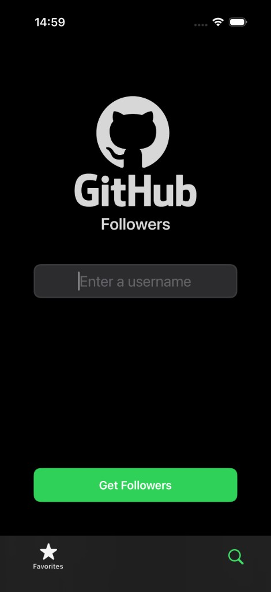
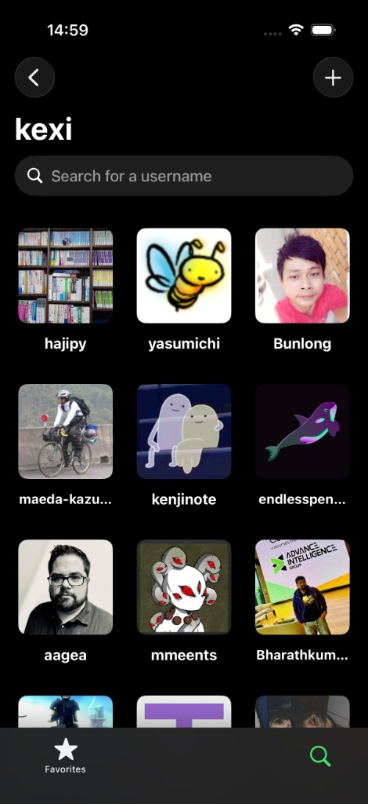
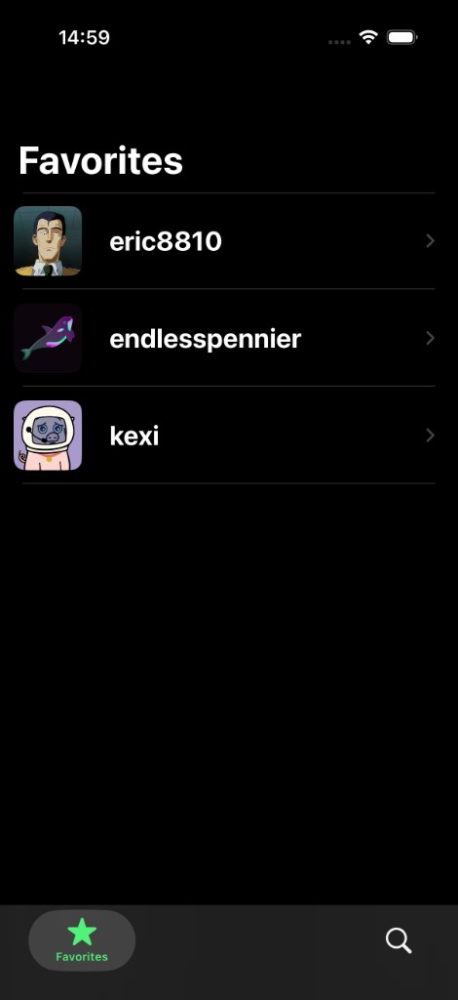
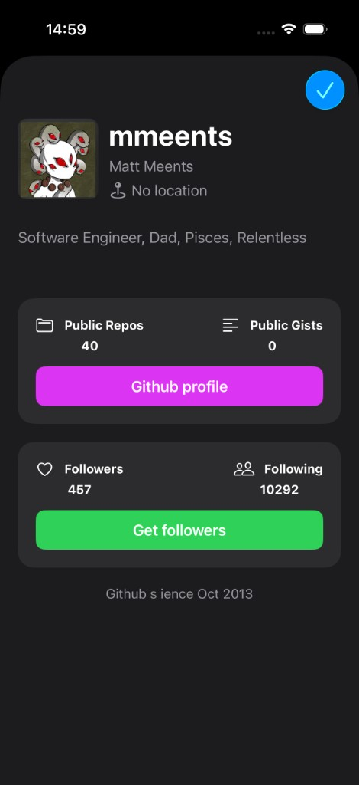

# GHFollowers iOS

A UIKit iOS app to search GitHub users, explore their followers, and save favorites locally.

## Demo

Screen recording: [`GHFollowers/git followers video.mov`](GHFollowers/git%20followers%20video.mov)

> Tip: GitHub may not always render `.mov` inline in README. If needed, click the link above to download and watch.

## Screenshots

| Search | Followers |
| --- | --- |
|  |  |

| Favorites | User Info |
| --- | --- |
|  |  |

## Features

- Search any GitHub username and fetch followers from the GitHub API.
- Infinite scrolling follower list with pagination.
- Real-time filtering with `UISearchController`.
- User detail modal with profile info, repo action, and follower action.
- Favorites management (add/remove) with local persistence.
- Empty-state and custom alert components for better UX.

## Tech Stack

- Swift
- UIKit (programmatic UI, no Storyboard-based screens)
- `URLSession` for networking
- `JSONDecoder` with `convertFromSnakeCase`
- `NSCache` for image caching
- `UserDefaults` for favorites persistence
- `UICollectionViewDiffableDataSource` for modern list updates

## App Flow

1. **Search tab**: Enter a GitHub username and tap **Get Followers**.
2. **Followers screen**: Browse followers, paginate, and filter by login.
3. **User info modal**: Open profile details, visit GitHub profile, or load that user’s followers.
4. **Favorites tab**: View and manage saved users.

## Project Structure

```text
GHFollowers/
├── Managers/           # Networking and persistence logic
├── Models/             # API models (Follower, User)
├── View controllers/   # Screen-level flow
├── Custom views/       # Reusable UI components
├── Extension/          # Helpful UIKit/Foundation extensions
├── Utilities/          # Errors, symbols, layout helpers
└── Support/            # AppDelegate, SceneDelegate, assets
```

## Getting Started

### Requirements

- Xcode 15+
- iOS 15+ simulator/device (recommended)
- Internet connection (for GitHub API requests)

### Run Locally

1. Clone the repository:
   ```bash
   git clone https://github.com/werter08/GitFollowersAppIOS.git
   ```
2. Open `GHFollowers.xcodeproj` in Xcode.
3. Select an iOS Simulator.
4. Build and run (`Cmd + R`).

## API

This app uses the public GitHub REST endpoints:

- `GET /users/{username}`
- `GET /users/{username}/followers`

Reference: [GitHub REST API docs](https://docs.github.com/en/rest)

---

If you like this project, feel free to fork it and build on top of it.
